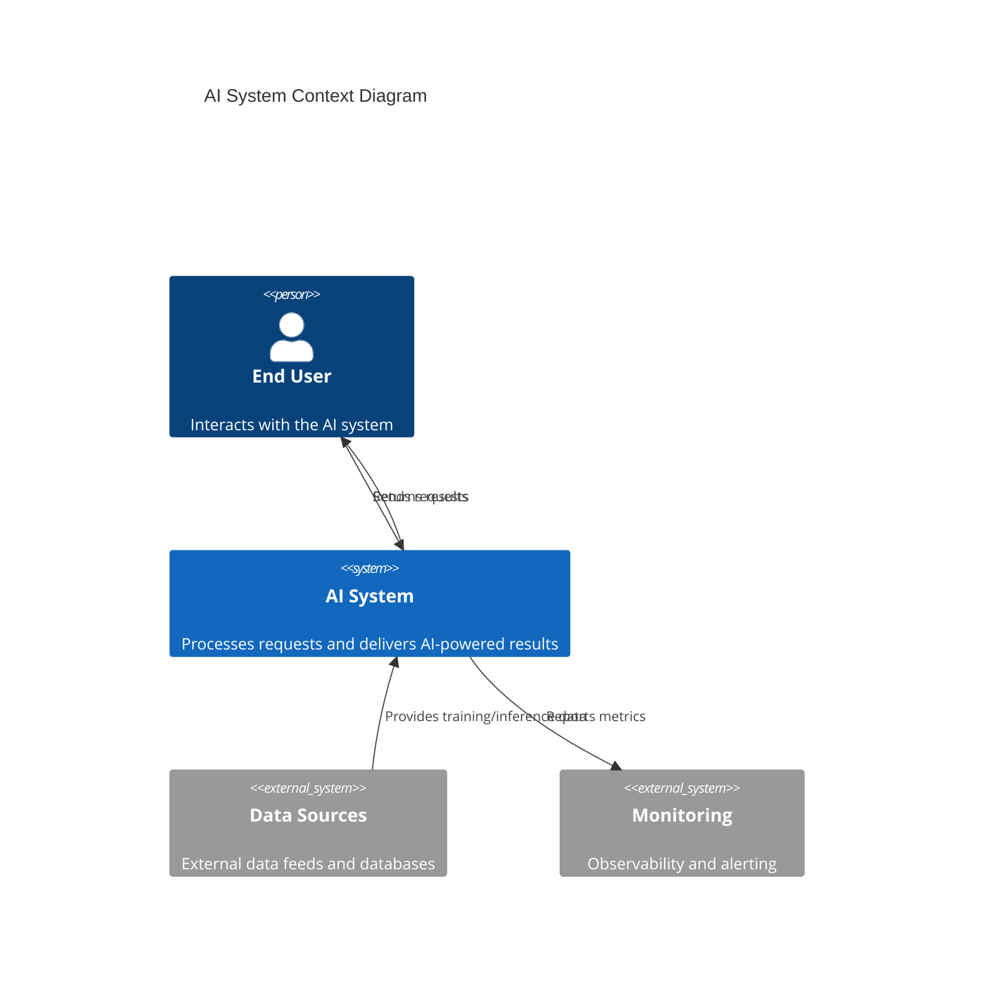
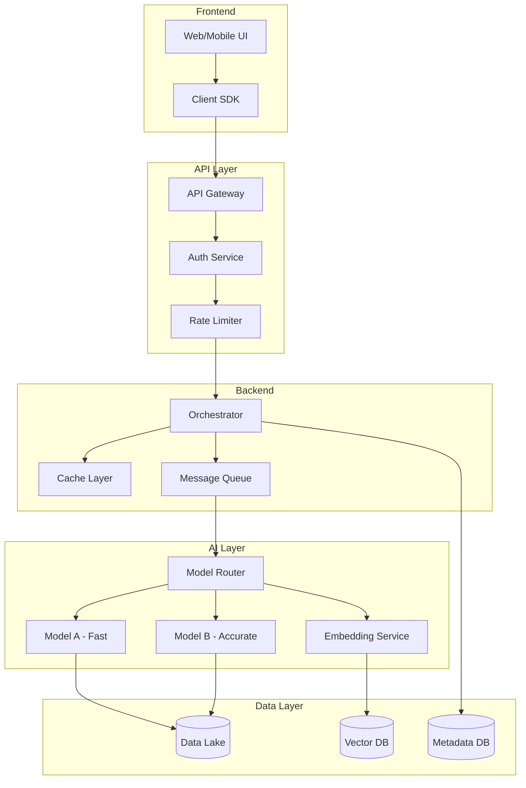
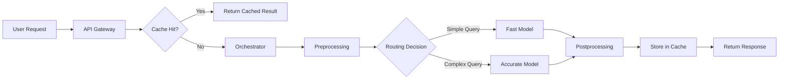
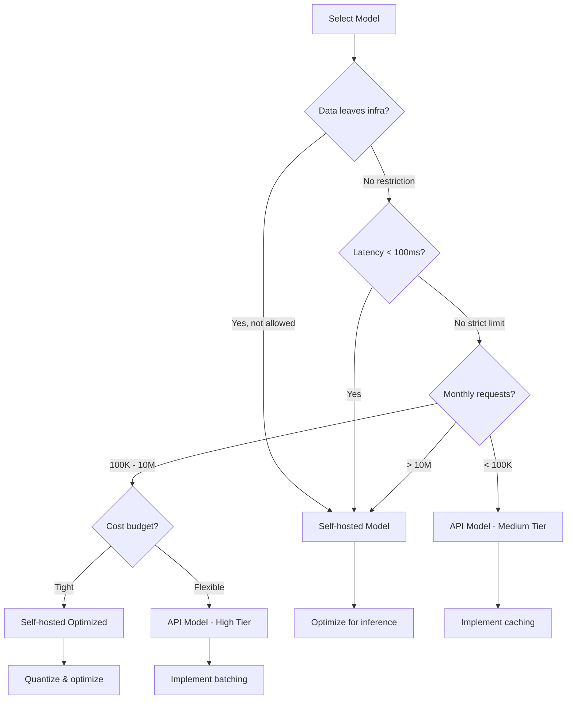

# Module 19: Architecting AI Solutions & System Design

## Overview

This module shifts from building individual AI components to designing complete AI-powered systems. You will learn how to translate business requirements into technical architectures, make informed trade-off decisions, and create blueprints that guide implementation.

---

## Learning Objectives

By the end of this module, you will be able to:

- Execute a structured system design process for AI products
- Identify and define core components of an AI system
- Create architecture diagrams using Mermaid
- Apply model selection strategies based on privacy, latency, cost, and performance constraints
- Decide between API-based and self-hosted model approaches
- Analyze trade-offs across accuracy, speed, cost, security, and scalability
- Design modular, maintainable, and scalable AI systems
- Conduct case study analysis from both technical and business perspectives

---

## 1. The AI System Design Process

Designing an AI system follows a structured process from understanding the problem to deploying a solution. Each stage builds on the previous one, and iteration is expected.

### 1.1 End-to-End Flow

```
Business Problem → Requirements → Architecture → Component Design → Trade-offs → Review → Implementation
```

**Stage 1: Problem Definition**
- What problem does this solve?
- Who are the end users?
- What is the expected business impact?
- What constraints exist (budget, timeline, regulations)?

**Stage 2: Requirements Gathering**
- Functional requirements: What must the system do?
- Non-functional requirements: Performance, scalability, security, cost
- Data requirements: Sources, volume, quality, privacy
- Integration requirements: Existing systems, APIs, databases

**Stage 3: High-Level Architecture**
- Identify major components
- Define data flow between components
- Sketch the system topology
- Identify external dependencies

**Stage 4: Component Design**
- Model selection and serving strategy
- Data pipeline design
- API contracts and interfaces
- Storage and caching layers
- Monitoring and observability

**Stage 5: Trade-off Analysis**
- Evaluate competing options
- Document assumptions and rationale
- Quantify costs and performance expectations
- Plan for iteration and improvement

**Stage 6: Design Review**
- Validate against requirements
- Identify risks and mitigation strategies
- Get stakeholder alignment
- Finalize the blueprint

---

## 2. Core Components of an AI System

Every AI-powered system consists of several interconnected components. Understanding these components and their relationships is fundamental to system design.

### 2.1 Data Layer

The foundation of any AI system. Responsible for collecting, storing, processing, and serving data.

- **Data Sources**: Databases, APIs, streams, files, user inputs
- **Data Storage**: Relational databases, NoSQL, data lakes, vector databases
- **Data Processing**: ETL pipelines, real-time streaming, batch processing
- **Data Quality**: Validation, deduplication, cleansing, monitoring

### 2.2 Model Layer

The intelligence core. Where models are trained, hosted, and served.

- **Model Training**: Offline training pipelines, experiment tracking, versioning
- **Model Serving**: Inference endpoints, batching strategies, caching
- **Model Management**: Versioning, A/B testing, rollback capabilities
- **Model Monitoring**: Performance drift, data drift, latency tracking

### 2.3 API Layer

The interface between the AI system and its consumers.

- **Request Handling**: Authentication, rate limiting, input validation
- **Routing**: Load balancing, request distribution
- **Response Formatting**: Serialization, error handling
- **Versioning**: API evolution without breaking existing clients

### 2.4 Backend Layer

The orchestration engine that connects all components.

- **Business Logic**: Workflow orchestration, decision routing
- **Integration**: Connecting to external services, databases, queues
- **Caching**: Result caching, model output caching
- **Security**: Authentication, authorization, data encryption

### 2.5 Frontend Layer

The user-facing interface where AI capabilities are consumed.

- **User Interface**: Web, mobile, desktop applications
- **Real-time Updates**: WebSockets, Server-Sent Events
- **Feedback Loops**: User feedback collection, rating systems
- **Explainability**: Making AI decisions transparent to users

---

## 3. Blueprint Creation with Mermaid Diagrams

A system blueprint is a visual representation of the architecture. Mermaid diagrams provide a text-based way to create and version these diagrams.

### 3.1 System Context Diagram

Shows the AI system in relation to external actors and systems.



### 3.2 Component Diagram

Details the internal components of the AI system.



### 3.3 Data Flow Diagram

Shows how data moves through the system.



---

## 4. Model Selection Strategy

Choosing the right model is one of the most consequential decisions in AI system design. It affects cost, performance, user experience, and operational complexity.

### 4.1 Key Factors

| Factor | Description | Weight |
|--------|-------------|--------|
| **Privacy** | Does the data leave your infrastructure? Regulatory requirements? | High for regulated industries |
| **Latency** | What is the acceptable response time? Real-time vs batch? | High for interactive applications |
| **Cost** | Per-request cost at scale? Infrastructure costs? | High for high-volume applications |
| **Performance** | What accuracy/quality is required? | High for critical decisions |
| **Maintenance** | Team capability to maintain models? Update frequency? | Medium for growing teams |
| **Scalability** | Expected request volume? Growth trajectory? | High for consumer products |

### 4.2 Decision Matrix

| Scenario | Recommended Approach |
|----------|---------------------|
| Low latency + High privacy | Self-hosted small model |
| High accuracy + Low volume | API model (GPT-4, Claude) |
| High volume + Low latency | Self-hosted optimized model |
| High privacy + High accuracy | Self-hosted large model with GPU |
| Prototyping + Low budget | API model with caching |
| Production + High scale | Hybrid: API fallback + self-hosted primary |

### 4.3 Model Selection Flowchart



---

## 5. API Model vs Self-Hosted Model

### 5.1 API Model (e.g., OpenAI, Anthropic, Google)

**Advantages:**
- No infrastructure management
- Access to cutting-edge models
- Easy to scale (provider handles it)
- Quick to prototype and deploy
- Automatic updates and improvements

**Disadvantages:**
- Data leaves your infrastructure
- Per-request cost adds up at scale
- Dependency on provider availability
- Rate limits may constrain usage
- Less control over model behavior

**Best For:**
- Prototyping and MVPs
- Low-to-medium volume applications
- Teams without ML infrastructure expertise
- Applications where data privacy is not a strict concern

### 5.2 Self-Hosted Model

**Advantages:**
- Full control over data and infrastructure
- Predictable cost at scale
- Customizable model behavior
- No rate limits
- Can run in air-gapped environments

**Disadvantages:**
- Requires ML infrastructure expertise
- Upfront infrastructure cost
- Must manage updates and maintenance
- Scaling requires additional engineering
- May lag behind latest model capabilities

**Best For:**
- High-volume production applications
- Regulated industries (healthcare, finance, government)
- Applications requiring model customization
- Systems with strict latency requirements

### 5.3 Hybrid Approach

Many production systems use a hybrid strategy:
- **Primary**: Self-hosted model for most requests
- **Fallback**: API model for overflow or complex cases
- **Caching**: Reduce total model calls
- **Routing**: Different models for different request types

---

## 6. Trade-off Analysis

Every architectural decision involves trade-offs. The key is making these trade-offs explicit and aligned with business priorities.

### 6.1 The Five-Way Trade-off

```
        Accuracy
           |
           |
Speed ----+---- Cost
           |
           |
      Security ---- Scalability
```

These five dimensions are often in tension:

- **Accuracy vs Speed**: Larger models are more accurate but slower
- **Accuracy vs Cost**: Higher accuracy often requires more expensive infrastructure
- **Speed vs Scalability**: Optimizing for speed may limit scaling options
- **Security vs Speed**: Encryption and validation add latency
- **Cost vs Scalability**: Scaling often increases costs

### 6.2 Quantifying Trade-offs

Use a scoring system to compare options objectively:

| Option | Accuracy | Speed | Cost | Security | Scalability | Total |
|--------|----------|-------|------|----------|-------------|-------|
| Option A | 9 | 6 | 5 | 8 | 7 | 35 |
| Option B | 7 | 9 | 8 | 7 | 8 | 39 |
| Option C | 8 | 7 | 7 | 9 | 6 | 37 |

Weights should reflect business priorities. A healthcare application might weight Security higher, while a consumer chat app might weight Speed higher.

### 6.3 Common Trade-off Scenarios

**Scenario: Chat Application**
- Priority: Speed and user experience
- Trade-off: Accept slightly lower accuracy for faster responses
- Solution: Use smaller model with caching, fallback to larger model for complex queries

**Scenario: Medical Diagnosis Support**
- Priority: Accuracy and security
- Trade-off: Accept higher cost and latency for better results
- Solution: Use large self-hosted model, process in batches, strict data controls

**Scenario: E-commerce Recommendations**
- Priority: Scalability and cost
- Trade-off: Optimize for throughput over individual accuracy
- Solution: Pre-compute recommendations, use embeddings with approximate nearest neighbor

---

## 7. Modular and Scalable Design Principles

### 7.1 Modularity

Design systems as independent, interchangeable components:

- **Separation of Concerns**: Each component has a single responsibility
- **Loose Coupling**: Components communicate through well-defined interfaces
- **High Cohesion**: Related functionality is grouped together
- **Replaceability**: Components can be swapped without affecting others

### 7.2 Scalability Patterns

**Horizontal Scaling**
- Add more instances of stateless components
- Use load balancers to distribute traffic
- Ensure no single point of failure

**Vertical Scaling**
- Increase resources for stateful components
- Optimize code for better resource utilization
- Use caching to reduce load

**Asynchronous Processing**
- Use message queues for non-real-time tasks
- Separate request handling from processing
- Enable backpressure handling

**Caching Strategies**
- Cache model predictions for repeated inputs
- Use CDN for static assets
- Implement multi-level caching (memory, distributed)

### 7.3 Design for Evolution

- **Feature Flags**: Deploy code without enabling features
- **A/B Testing**: Compare model versions in production
- **Canary Deployments**: Gradually roll out changes
- **Blue-Green Deployments**: Switch traffic between environments

---

## 8. Case Study Analysis Framework

When analyzing AI system designs, examine both technical and business perspectives.

### 8.1 Technical Analysis

1. **Architecture Review**
   - Component identification and responsibilities
   - Data flow and dependencies
   - Technology choices and rationale

2. **Performance Analysis**
   - Latency budget breakdown
   - Throughput requirements
   - Resource utilization

3. **Reliability Analysis**
   - Failure modes and recovery
   - Redundancy and fault tolerance
   - Monitoring and alerting

### 8.2 Business Analysis

1. **Value Proposition**
   - Problem solved for users
   - Competitive advantage
   - Revenue impact or cost savings

2. **Cost Structure**
   - Infrastructure costs
   - Development and maintenance costs
   - Cost per transaction

3. **Risk Assessment**
   - Technical risks
   - Business risks
   - Regulatory risks

4. **Scalability Business Case**
   - Growth projections
   - Cost at scale
   - Resource requirements

### 8.3 Evaluation Template

```
## Case Study: [System Name]

### Problem Statement
[What problem does this solve?]

### Requirements
- Functional: [List key features]
- Non-functional: [Performance, scalability, etc.]

### Architecture
[Diagram and component descriptions]

### Key Decisions
1. [Decision 1]: [Rationale]
2. [Decision 2]: [Rationale]

### Trade-offs
[What was gained, what was sacrificed]

### Outcome
[Results, lessons learned]

### Lessons for Similar Projects
[Applicable principles]
```

---

## 9. Design Review Checklist

Before finalizing an architecture, verify against this checklist:

### Functional Requirements
- [ ] All user stories are addressed
- [ ] Input/output formats are defined
- [ ] Error handling is specified
- [ ] Edge cases are identified

### Non-Functional Requirements
- [ ] Latency targets are defined
- [ ] Throughput requirements are met
- [ ] Scalability plan is documented
- [ ] Security measures are in place

### Data
- [ ] Data sources are identified
- [ ] Data quality requirements are defined
- [ ] Privacy regulations are addressed
- [ ] Data retention policies are set

### Model
- [ ] Model selection is justified
- [ ] Serving strategy is defined
- [ ] Monitoring plan is in place
- [ ] Update/rollback process is documented

### Infrastructure
- [ ] Deployment strategy is defined
- [ ] Scaling strategy is documented
- [ ] Cost estimates are provided
- [ ] Disaster recovery plan exists

### Operations
- [ ] Monitoring and alerting are configured
- [ ] Logging strategy is defined
- [ ] Incident response process exists
- [ ] On-call responsibilities are assigned

---

## 10. Summary

System design for AI is about making informed decisions under constraints. The key takeaways:

1. **Follow a structured process**: Problem → Requirements → Architecture → Components → Trade-offs → Review
2. **Understand your components**: Data, Model, API, Backend, Frontend — each has specific responsibilities
3. **Use visual blueprints**: Mermaid diagrams make architectures communicable and versionable
4. **Choose models strategically**: Privacy, latency, cost, and performance drive the decision
5. **Make trade-offs explicit**: Document what you're gaining and what you're sacrificing
6. **Design for evolution**: Systems will change; build for maintainability
7. **Validate with checklists**: Ensure nothing is missed before implementation

---

## Next Steps

- Work through the notebooks for hands-on practice with system design frameworks
- Complete the exercises to apply these concepts to real scenarios
- Review the case studies to see how these principles apply in practice

---

## Resources

See [resources.md](resources.md) for additional reading, tools, and references.
