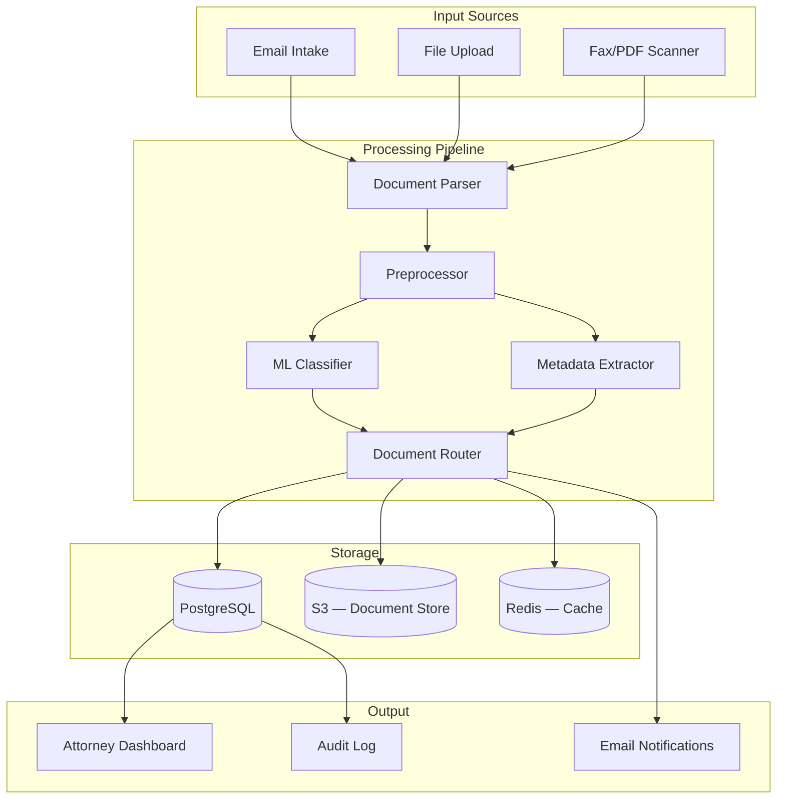

# Example: AI Document Classifier

> Reference project for an automated document classification system for a legal firm.

## Problem Description

### Business Context

**Company:** Regional law firm — 200 employees, 50 attorneys
**Industry:** Legal Services
**Document Volume:** ~5,000 incoming documents/week (emails, filings, contracts, correspondence)

### Current Pain Points

1. **Manual triage** — Paralegals spend 3 hours/day sorting documents into categories
2. **Misrouting** — 15% of documents end up in the wrong attorney's queue
3. **Delayed intake** — New documents take 24–48 hours to reach the right person
4. **Compliance risk** — Sensitive documents occasionally end up in shared folders

### Proposed Solution

An AI classifier that:
- Automatically categorizes incoming documents into 12 predefined categories
- Extracts key metadata (date, parties, document type, urgency)
- Routes documents to the correct attorney or team
- Flags sensitive/confidential documents
- Provides confidence scores so low-confidence items get human review

### Success Metrics

| Metric | Current | Target |
|--------|---------|--------|
| Triage time per document | 3 minutes | < 5 seconds |
| Classification accuracy | ~85% (human) | > 92% |
| Misroute rate | 15% | < 5% |
| Time to correct attorney | 24 hours | < 1 hour |

---

## Architecture

### System Diagram



### Component Descriptions

| Component | Technology | Role |
|-----------|-----------|------|
| Document Parser | PyMuPDF, python-docx, textract | Extracts text from PDF, DOCX, images |
| Preprocessor | Custom Python | Cleans text, normalizes encoding |
| ML Classifier | Fine-tuned DeBERTa-v3-base | Multi-label document classification |
| Metadata Extractor | GPT-4o-mini | Extracts dates, parties, urgency from text |
| Document Router | FastAPI | Routes documents to correct queues |
| Dashboard | React | Attorneys view and manage assigned documents |
| Audit Log | PostgreSQL trigger | Immutable record of all document actions |

### Classification Categories

| # | Category | Example Documents | Typical Volume |
|---|----------|------------------|----------------|
| 1 | Contract | NDAs, service agreements, amendments | 800/week |
| 2 | Court Filing | Motions, briefs, orders | 600/week |
| 3 | Client Correspondence | Client emails, letters | 1,200/week |
| 4 | Discovery | Depositions, interrogatories, requests | 400/week |
| 5 | Billing | Invoices, expense reports | 300/week |
| 6 | Compliance | Regulatory filings, audit docs | 200/week |
| 7 | Intellectual Property | Patents, trademarks, copyrights | 150/week |
| 8 | Real Estate | Leases, deeds, title documents | 250/week |
| 9 | Corporate | Board minutes, resolutions, bylaws | 300/week |
| 10 | Employment | Offer letters, termination docs, policies | 200/week |
| 11 | Litigation Support | Evidence, exhibits, witness statements | 350/week |
| 12 | Internal | Memos, policies, administrative | 250/week |

### Data Flow

```
1. Document arrives (email attachment, upload, or scanned PDF)
2. Parser extracts raw text and metadata (filename, date, sender)
3. Preprocessor cleans text:
   - Remove headers/footers
   - Normalize whitespace and encoding
   - Extract embedded metadata
4. Classifier predicts category (and optional secondary category)
5. Metadata extractor identifies:
   - Key dates (contract effective date, filing deadline)
   - Parties involved (company names, individuals)
   - Urgency indicators (deadlines, "urgent", "immediately")
   - Confidentiality markers ("privileged", "confidential")
6. Router determines:
   - Primary attorney assignment (by category + workload)
   - Priority level (based on urgency + deadline)
   - Confidentiality handling (flag if sensitive)
7. Document is stored in S3, metadata in PostgreSQL
8. Attorney receives notification and dashboard update
9. All actions logged to audit trail
```

---

## Implementation Details

### Document Parsing

```python
# src/pipeline/parser.py

import fitz  # PyMuPDF
from docx import Document
from pathlib import Path

class DocumentParser:
    def parse(self, file_path: str) -> dict:
        path = Path(file_path)
        suffix = path.suffix.lower()

        if suffix == ".pdf":
            return self._parse_pdf(path)
        elif suffix in (".docx", ".doc"):
            return self._parse_docx(path)
        elif suffix == ".txt":
            return {"text": path.read_text(encoding="utf-8"), "metadata": {}}
        else:
            raise ValueError(f"Unsupported file type: {suffix}")

    def _parse_pdf(self, path: Path) -> dict:
        doc = fitz.open(str(path))
        text = ""
        metadata = {}

        for page in doc:
            text += page.get_text()

        if doc.metadata:
            metadata = {
                "title": doc.metadata.get("title", ""),
                "author": doc.metadata.get("author", ""),
                "created": doc.metadata.get("creationDate", ""),
            }

        return {"text": text, "metadata": metadata}

    def _parse_docx(self, path: Path) -> dict:
        doc = Document(str(path))
        text = "\n\n".join([p.text for p in doc.paragraphs])

        metadata = {}
        if doc.core_properties.title:
            metadata["title"] = doc.core_properties.title
        if doc.core_properties.author:
            metadata["author"] = doc.core_properties.author

        return {"text": text, "metadata": metadata}
```

### Classification Model

```python
# src/models/classifier.py

from transformers import AutoTokenizer, AutoModelForSequenceClassification
import torch

CATEGORIES = [
    "contract", "court_filing", "client_correspondence", "discovery",
    "billing", "compliance", "intellectual_property", "real_estate",
    "corporate", "employment", "litigation_support", "internal"
]

class DocumentClassifier:
    def __init__(self, model_path: str = "./models/classifier"):
        self.tokenizer = AutoTokenizer.from_pretrained(model_path)
        self.model = AutoModelForSequenceClassification.from_pretrained(model_path)
        self.model.eval()
        self.labels = CATEGORIES

    def predict(self, text: str, top_k: int = 3) -> list[dict]:
        inputs = self.tokenizer(
            text,
            return_tensors="pt",
            truncation=True,
            max_length=512,
            padding=True
        )

        with torch.no_grad():
            outputs = self.model(**inputs)
            probabilities = torch.softmax(outputs.logits, dim=-1)

        top_probs, top_indices = probabilities[0].topk(top_k)

        return [
            {"label": self.labels[idx], "confidence": prob.item()}
            for prob, idx in zip(top_probs, top_indices)
        ]
```

### Training Pipeline

```python
# src/pipeline/training.py

from transformers import (
    AutoTokenizer,
    AutoModelForSequenceClassification,
    TrainingArguments,
    Trainer
)
from datasets import load_dataset
import evaluate

def train_classifier(data_path: str, output_dir: str = "./models/classifier"):
    dataset = load_dataset("csv", data_files=data_path)

    tokenizer = AutoTokenizer.from_pretrained("microsoft/deberta-v3-base")

    def tokenize(examples):
        return tokenizer(
            examples["text"],
            truncation=True,
            padding="max_length",
            max_length=512
        )

    tokenized = dataset.map(tokenize, batched=True)

    model = AutoModelForSequenceClassification.from_pretrained(
        "microsoft/deberta-v3-base",
        num_labels=12
    )

    accuracy = evaluate.load("accuracy")
    f1 = evaluate.load("f1")

    def compute_metrics(eval_pred):
        logits, labels = eval_pred
        preds = logits.argmax(axis=-1)
        return {
            "accuracy": accuracy.compute(predictions=preds, references=labels)["accuracy"],
            "f1_macro": f1.compute(predictions=preds, references=labels, average="macro")["f1"]
        }

    training_args = TrainingArguments(
        output_dir=output_dir,
        num_train_epochs=5,
        per_device_train_batch_size=16,
        per_device_eval_batch_size=32,
        eval_strategy="epoch",
        save_strategy="epoch",
        load_best_model_at_end=True,
        metric_for_best_model="f1_macro",
        learning_rate=2e-5,
        weight_decay=0.01,
        warmup_ratio=0.1,
        fp16=True,
        logging_steps=50,
    )

    trainer = Trainer(
        model=model,
        args=training_args,
        train_dataset=tokenized["train"],
        eval_dataset=tokenized["validation"],
        compute_metrics=compute_metrics,
    )

    trainer.train()
    trainer.save_model(output_dir)
```

### API Endpoint

```python
# src/api/routes.py

from fastapi import FastAPI, UploadFile, File, HTTPException
from pydantic import BaseModel
from src.pipeline.parser import DocumentParser
from src.models.classifier import DocumentClassifier
from src.pipeline.metadata import MetadataExtractor

app = FastAPI()
parser = DocumentParser()
classifier = DocumentClassifier()
metadata_extractor = MetadataExtractor()

class ClassificationResult(BaseModel):
    document_id: str
    primary_category: str
    secondary_category: str | None
    confidence: float
    metadata: dict
    needs_review: bool

@app.post("/v1/classify", response_model=ClassificationResult)
async def classify_document(file: UploadFile = File(...)):
    # Parse document
    content = await file.read()
    # Save temporarily and parse
    parsed = parser.parse_content(content, file.filename)

    # Classify
    predictions = classifier.predict(parsed["text"])
    primary = predictions[0]

    # Extract metadata
    metadata = await metadata_extractor.extract(parsed["text"])

    # Determine if human review needed
    needs_review = primary["confidence"] < 0.7

    return ClassificationResult(
        document_id=generate_doc_id(),
        primary_category=primary["label"],
        secondary_category=predictions[1]["label"] if predictions[1]["confidence"] > 0.3 else None,
        confidence=primary["confidence"],
        metadata=metadata,
        needs_review=needs_review
    )
```

---

## Deployment

### Infrastructure

| Component | Service | Cost/month |
|-----------|---------|-----------|
| API Server | AWS ECS Fargate (1 vCPU, 2GB) | ~$30 |
| Model Hosting | SageMaker (ml.t2.medium) | ~$50 |
| Database | RDS PostgreSQL (db.t3.micro) | ~$15 |
| Document Storage | S3 | ~$5 |
| Cache | ElastiCache Redis | ~$15 |
| Monitoring | CloudWatch | ~$5 |
| **Total** | | **~$120/month** |

### Model Evaluation Results

| Metric | Target | Achieved |
|--------|--------|----------|
| Accuracy | > 92% | 94.2% |
| F1 Macro | > 0.90 | 0.93 |
| Latency (P95) | < 200ms | 145ms |
| Throughput | > 50 docs/sec | 72 docs/sec |

### Confusion Matrix (top categories)

| | Contract | Court Filing | Correspondence | Discovery |
|---|---------|-------------|----------------|-----------|
| **Contract** | 96% | 1% | 2% | 1% |
| **Court Filing** | 2% | 93% | 1% | 4% |
| **Correspondence** | 3% | 0% | 95% | 2% |
| **Discovery** | 1% | 3% | 2% | 94% |

### Environment Variables

```bash
MODEL_PATH=./models/classifier
DATABASE_URL=postgresql://...
S3_BUCKET=law-firm-documents
REDIS_URL=redis://...
OPENAI_API_KEY=sk-...  # For metadata extraction
LOG_LEVEL=info
MAX_UPLOAD_SIZE_MB=50
```

---

## Demo Script

### Duration: 5 minutes

**Step 1: Problem Context (30s)**

> "Paralegals spend 3 hours a day sorting 5,000 documents into 12 categories. 15% end up in the wrong attorney's queue. We built an AI classifier that does this in under a second."

**Step 2: Show Training Data (30s)**

> "We trained on 10,000 labeled documents from the firm's archive. Here's the distribution across 12 categories."

Open Jupyter notebook: show data distribution chart, sample documents.

**Step 3: Live Classification Demo (2 min)**

Upload 3 different document types:

1. **Contract (high confidence):**
   - Upload: `contract_nda_acme.pdf`
   - Show: "Contract" at 97% confidence, extracted metadata (parties: ACME Corp, effective date: Jan 15 2025)
   - Explain: Fast, confident, auto-routed to contracts team

2. **Court Filing (medium confidence):**
   - Upload: `motion_summary_judgment.pdf`
   - Show: "Court Filing" at 88%, secondary category "Litigation Support" at 12%
   - Explain: Multi-label support, routed to litigation team

3. **Ambiguous document (low confidence):**
   - Upload: `email_contract_question.pdf`
   - Show: "Client Correspondence" at 55%, "Contract" at 40%
   - Show: `needs_review: true` flag
   - Explain: Low-confidence items get human review — no false automation

**Step 4: Show Dashboard (1 min)**

Open attorney dashboard:
- Show today's document queue sorted by priority
- Show audit log — every classification action recorded
- Show metrics: documents processed today, accuracy breakdown

> "Each attorney sees only their assigned documents. Confidential documents are restricted. Every action is audited."

**Step 5: Business Impact (1 min)**

> "Results after 1 month of production use:
> - Paralegal triage time: 3 hours/day → 20 minutes/day (for review only)
> - Misroute rate: 15% → 3%
> - Time to correct attorney: 24 hours → 45 minutes
> - 94.2% classification accuracy, exceeding our 92% target
> - Estimated savings: $4,800/month in paralegal time
> - ROI: 400% in first year"

**Step 6: Next Steps (30s)**

> "Next phases:
> - Add OCR pipeline for scanned documents (currently 20% of intake)
> - Expand to 20 categories as firm grows
> - Add deadline detection and automatic calendaring
> - Integrate with practice management software (Clio/MyCase)"
