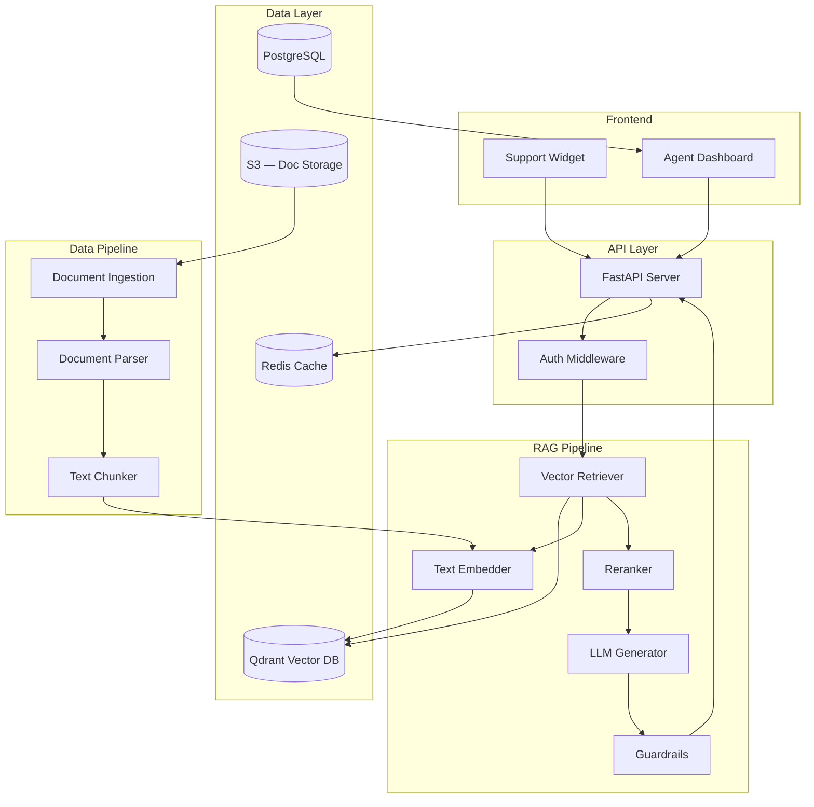

# Example: RAG-Based Customer Support Chatbot

> Reference project for a Retrieval-Augmented Generation chatbot that answers customer questions using company documentation.

## Problem Description

### Business Context

**Company:** MidSize SaaS — project management tool with 50,000+ users
**Industry:** B2B Software
**Support Team:** 15 agents handling ~2,000 tickets/week

### Current Pain Points

1. **Repetitive questions** — 60% of tickets are the same 50 questions (pricing, integrations, billing)
2. **Slow first response** — Average first response time is 4 hours during peak
3. **Inconsistent answers** — Different agents give slightly different answers to the same question
4. **Knowledge scattered** — Help docs, FAQs, internal wiki, and Slack threads are all separate

### Proposed Solution

A RAG chatbot embedded in the support widget that:
- Retrieves relevant answers from company documentation
- Generates natural language responses with citations
- Escalates to human agents when confidence is low
- Learns from new documentation automatically

### Success Metrics

| Metric | Current | Target |
|--------|---------|--------|
| First response time | 4 hours | < 30 seconds |
| Ticket resolution (self-serve) | 0% | 40% |
| Answer accuracy | ~75% (human) | > 85% |
| Agent time saved | 0 hrs/week | 60 hrs/week |

---

## Architecture

### System Diagram



### Component Descriptions

| Component | Technology | Role |
|-----------|-----------|------|
| Support Widget | React component | User-facing chat interface |
| FastAPI Server | Python, FastAPI | API gateway, request handling |
| Text Embedder | OpenAI text-embedding-3-small | Converts queries to vectors |
| Vector Retriever | Qdrant | Finds relevant document chunks |
| Reranker | Cohere Rerank | Re-scores retrieved chunks |
| LLM Generator | GPT-4o-mini | Generates natural language answers |
| Guardrails | Guardrails AI | Validates output, blocks hallucinations |
| Document Ingestion | Custom pipeline | Processes new docs into embeddings |

### Data Flow

```
1. User sends question via widget
2. API checks Redis cache (exact match)
3. On cache miss:
   a. Query is embedded (text-embedding-3-small)
   b. Top 20 chunks retrieved from Qdrant
   c. Reranker selects top 5 most relevant chunks
   d. Prompt is built: system prompt + 5 chunks + user query
   e. LLM generates answer
   f. Guardrails validates:
      - Answer is grounded in retrieved chunks
      - No hallucinated information
      - No sensitive data leakage
   g. If validation fails → fallback to "I'll connect you with an agent"
4. Response is cached in Redis (TTL: 1 hour)
5. Response is returned to user
6. Conversation is logged to PostgreSQL
```

---

## Implementation Details

### Document Ingestion Pipeline

```python
# src/pipeline/ingestion.py

from langchain.text_splitter import RecursiveCharacterTextSplitter
from langchain_community.document_loaders import S3DirectoryLoader
from qdrant_client import QdrantClient
from openai import OpenAI

class DocumentIngestion:
    def __init__(self):
        self.client = OpenAI()
        self.qdrant = QdrantClient(host="localhost", port=6333)
        self.splitter = RecursiveCharacterTextSplitter(
            chunk_size=500,
            chunk_overlap=50,
            separators=["\n\n", "\n", ". ", " "]
        )

    def ingest(self, s3_path: str, collection: str = "docs"):
        loader = S3DirectoryLoader(s3_path)
        documents = loader.load()

        chunks = self.splitter.split_documents(documents)

        embeddings = []
        for chunk in chunks:
            response = self.client.embeddings.create(
                model="text-embedding-3-small",
                input=chunk.page_content
            )
            embeddings.append(response.data[0].embedding)

        self.qdrant.upsert(
            collection_name=collection,
            points=[
                {
                    "id": i,
                    "vector": emb,
                    "payload": {
                        "text": chunk.page_content,
                        "source": chunk.metadata.get("source", "unknown"),
                        "page": chunk.metadata.get("page", 0)
                    }
                }
                for i, (emb, chunk) in enumerate(zip(embeddings, chunks))
            ]
        )
```

### Retrieval and Generation

```python
# src/pipeline/rag.py

from openai import OpenAI
from qdrant_client import QdrantClient
from guardrails import Guard

class RAGPipeline:
    def __init__(self):
        self.openai = OpenAI()
        self.qdrant = QdrantClient(host="localhost", port=6333)

    def answer(self, query: str, chat_history: list = None) -> dict:
        # Embed query
        query_embedding = self._embed(query)

        # Retrieve
        results = self.qdrant.search(
            collection_name="docs",
            query_vector=query_embedding,
            limit=20
        )

        # Rerank
        reranked = self._rerank(query, [r.payload["text"] for r in results])
        top_chunks = reranked[:5]

        # Build prompt
        context = "\n\n---\n\n".join(top_chunks)
        messages = [
            {"role": "system", "content": SYSTEM_PROMPT.format(context=context)},
        ]
        if chat_history:
            messages.extend(chat_history[-6:])
        messages.append({"role": "user", "content": query})

        # Generate
        response = self.openai.chat.completions.create(
            model="gpt-4o-mini",
            messages=messages,
            temperature=0.3
        )

        return {
            "answer": response.choices[0].message.content,
            "sources": [r.payload["source"] for r in results[:3]],
            "confidence": self._calculate_confidence(results)
        }

    def _embed(self, text: str) -> list[float]:
        response = self.openai.embeddings.create(
            model="text-embedding-3-small",
            input=text
        )
        return response.data[0].embedding
```

### API Endpoint

```python
# src/api/routes.py

from fastapi import FastAPI, HTTPException
from pydantic import BaseModel
from src.pipeline.rag import RAGPipeline

app = FastAPI()
rag = RAGPipeline()

class QueryRequest(BaseModel):
    query: str
    chat_history: list[dict] | None = None

class QueryResponse(BaseModel):
    answer: str
    sources: list[str]
    confidence: float

@app.post("/v1/chat", response_model=QueryResponse)
async def chat(request: QueryRequest):
    if not request.query.strip():
        raise HTTPException(status_code=400, detail="Query cannot be empty")

    result = rag.answer(request.query, request.chat_history)

    if result["confidence"] < 0.3:
        return QueryResponse(
            answer="I'm not confident in my answer. Let me connect you with a support agent.",
            sources=[],
            confidence=result["confidence"]
        )

    return QueryResponse(**result)
```

---

## Deployment

### Infrastructure

| Component | Service | Cost/month |
|-----------|---------|-----------|
| API Server | AWS ECS Fargate (0.5 vCPU, 1GB) | ~$15 |
| Vector DB | Qdrant Cloud (1 node) | $25 |
| Database | Supabase (free tier) | $0 |
| Cache | Upstash Redis | $10 |
| LLM API | OpenAI (GPT-4o-mini) | ~$50 (est. 10K queries/day) |
| Embeddings | OpenAI (text-embedding-3-small) | ~$5 |
| **Total** | | **~$105/month** |

### Docker Compose

```yaml
version: "3.9"
services:
  api:
    build: .
    ports: ["8000:8000"]
    env_file: .env
    depends_on: [qdrant, redis]
    deploy:
      replicas: 2

  qdrant:
    image: qdrant/qdrant:latest
    volumes: [qdrant_data:/qdrant/storage]
    ports: ["6333:6333"]

  redis:
    image: redis:7-alpine
    ports: ["6379:6379"]

volumes:
  qdrant_data:
```

### Environment Variables

```bash
OPENAI_API_KEY=sk-...
QDRANT_HOST=localhost
QDRANT_PORT=6333
REDIS_URL=redis://localhost:6379/0
DATABASE_URL=postgresql://...
GUARDRAILS_API_KEY=...
LOG_LEVEL=info
```

---

## Demo Script

### Duration: 5 minutes

**Step 1: Problem Context (30s)**

> "Our support team handles 2,000 tickets a week. 60% are the same questions. Average first response is 4 hours. We built a RAG chatbot that handles common questions instantly."

**Step 2: Show Documentation (30s)**

> "Here's our help documentation — 200+ articles covering billing, integrations, and troubleshooting. These are indexed into our vector database."

Open Qdrant dashboard: show collection stats, sample chunks.

**Step 3: Live Chat Demo (2 min)**

Input 1 — Simple factual question:
> "How do I connect Slack to my project?"

Show: sources cited, fast response (< 2 seconds).

Input 2 — Complex multi-part question:
> "What happens to my data if I downgrade my plan?"

Show: answer references multiple documents, accurate.

Input 3 — Out-of-scope question:
> "Can you write me a Python script?"

Show: graceful fallback — "I can help with product questions. Let me connect you with support."

**Step 4: Show Monitoring (30s)**

Open Grafana dashboard: show request volume, latency, confidence distribution.

> "P95 latency is 1.8 seconds. 85% of queries get confidence > 0.7. Only 5% escalate to human agents."

**Step 5: Business Impact (1 min)**

> "After a 2-week pilot with 500 users:
> - 42% of queries resolved without an agent
> - Average response time dropped from 4 hours to 3 seconds
> - Support team now focuses on complex technical issues
> - Estimated savings: $2,400/month in agent time"

**Step 6: Next Steps (30s)**

> "Next we plan to:
> - Add multi-language support
> - Integrate with our ticketing system for automatic escalation
> - Fine-tune on resolved tickets for better accuracy"
