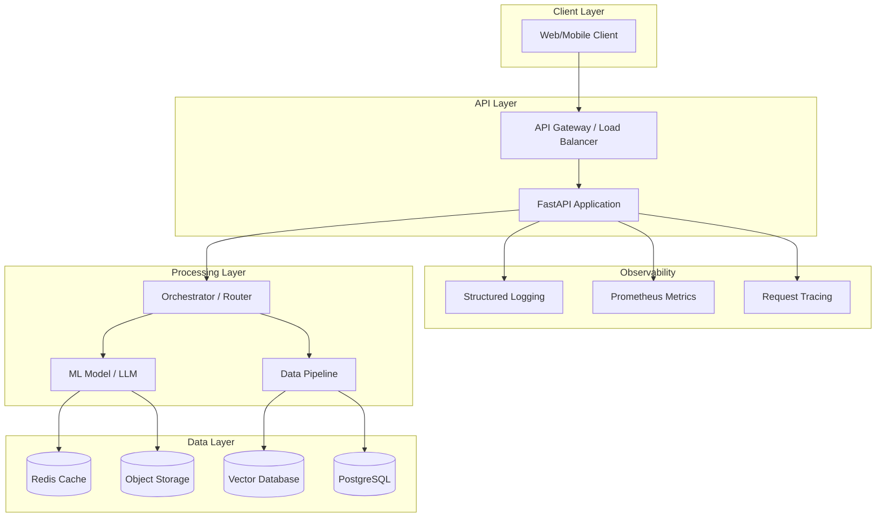

# Architecture

## System Overview

[Replace this with a brief description of what your system does and how it's organized.]

## System Diagram



## Component Descriptions

### Client Layer

| Component | Technology | Purpose |
|-----------|-----------|---------|
| Web Client | [e.g., React, Streamlit] | User interface for interaction |

### API Layer

| Component | Technology | Purpose |
|-----------|-----------|---------|
| API Gateway | [e.g., nginx, AWS ALB] | Routing, rate limiting, TLS termination |
| FastAPI App | FastAPI + Uvicorn | Request handling, validation, business logic |

### Processing Layer

| Component | Technology | Purpose |
|-----------|-----------|---------|
| Orchestrator | [Custom code / LangChain] | Routes requests, chains components |
| ML Model | [e.g., GPT-4, fine-tuned BERT, Whisper] | Core inference |
| Data Pipeline | [e.g., pandas, Spark] | Pre/post-processing |

### Data Layer

| Component | Technology | Purpose |
|-----------|-----------|---------|
| Vector DB | [e.g., ChromaDB, Qdrant] | Semantic search, embeddings storage |
| Cache | Redis | Session cache, rate limiting |
| PostgreSQL | PostgreSQL 15 | Structured data, metadata |
| Object Storage | S3 / local | Model artifacts, documents |

## Data Flow

### Inference Flow (Happy Path)

```
1. Client sends request to API
2. API validates input schema
3. Request is cached-checked (Redis)
4. On cache miss:
   a. Input is preprocessed
   b. Query is embedded (if semantic search needed)
   c. Relevant context is retrieved from Vector DB
   d. Prompt is constructed with context
   e. Model inference is performed
   f. Output is postprocessed
5. Response is cached
6. Response is returned to client
```

### Training / Fine-tuning Flow

```
1. Raw data is ingested from source
2. Data is validated and cleaned
3. Data is split into train/val/test
4. Model is trained or fine-tuned
5. Model is evaluated against metrics
6. If metrics pass threshold:
   a. Model artifact is versioned
   b. Model is registered in model registry
   c. Deployment is triggered
```

## Technology Choices and Justifications

| Decision | Choice | Alternatives Considered | Justification |
|----------|--------|------------------------|---------------|
| API Framework | FastAPI | Flask, Django | Async support, auto-docs, Pydantic validation |
| Vector DB | [Choice] | [Alt 1], [Alt 2] | [Why] |
| LLM Provider | [Choice] | [Alt 1], [Alt 2] | [Why] |
| Container Runtime | Docker | Podman | Industry standard, team familiarity |
| Cloud Provider | [Choice] | [Alt 1], [Alt 2] | [Why] |

Replace the table above with your actual decisions.

## Non-Functional Requirements

### Performance

| Metric | Requirement | How Measured |
|--------|-------------|-------------|
| Latency (P50) | [< X ms] | Application metrics |
| Latency (P95) | [< Y ms] | Application metrics |
| Throughput | [> Z req/s] | Load test results |
| Uptime | [> 99.X%] | Health check monitoring |

### Scalability

| Dimension | Strategy |
|-----------|----------|
| Horizontal | [e.g., Kubernetes HPA, multiple API replicas] |
| Vertical | [e.g., GPU instance scaling] |
| Data | [e.g., sharding, partitioning] |

### Security

| Concern | Approach |
|---------|----------|
| Authentication | [e.g., API key, JWT, OAuth2] |
| Authorization | [e.g., role-based access] |
| Data Encryption | [e.g., TLS in transit, AES at rest] |
| Secrets Management | [e.g., environment variables, Vault] |
| Rate Limiting | [e.g., per-key throttling] |

### Monitoring & Observability

| Signal | Tool | Alert Threshold |
|--------|------|----------------|
| Request latency | Prometheus | P95 > [X] ms |
| Error rate | Prometheus | > [X]% 5xx |
| Model drift | [Custom / Evidently] | [Threshold] |
| Resource usage | Grafana | CPU > 80%, Memory > 85% |

## Cost Estimation

### Development (3-week bootcamp)

| Resource | Unit Cost | Estimated Usage | Total |
|----------|----------|----------------|-------|
| Cloud compute (dev) | $[X]/hr | [Y] hrs | $[Z] |
| LLM API calls | $[X]/1K tokens | [Y]K tokens | $[Z] |
| Vector DB (managed) | $[X]/month | 1 month | $[Z] |
| Storage | $[X]/GB | [Y] GB | $[Z] |
| **Total** | | | **$[TOTAL]** |

### Production (estimated monthly)

| Resource | Unit Cost | Estimated Usage | Total |
|----------|----------|----------------|-------|
| Compute (prod) | $[X]/month | [Y] units | $[Z] |
| LLM API calls | $[X]/1K tokens | [Y]K tokens | $[Z] |
| Managed services | $[X]/month | — | $[Z] |
| **Total** | | | **$[TOTAL]/month** |

## Decisions Log

| # | Date | Decision | Rationale | alternatives |
|---|------|----------|-----------|--------------|
| 1 | [Date] | [What was decided] | [Why] | [What else was considered] |
| 2 | [Date] | [What was decided] | [Why] | [What else was considered] |
